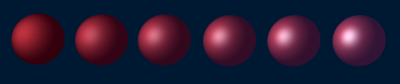
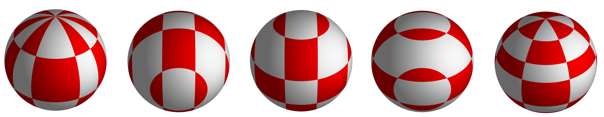

__A simple ray tracer for embeded systems.__ Written in a week as an introduction to the rust programming language.

[](https://travis-ci.org/Rust-Mikrocontroller-Praktikum-2017/raytracer)



_Shown above are spheres with increasing reflection coefficient._



_Different methods to apply a tiled 2D texture to an object._


---
<p align=center><strong>Table of Contents</strong></p>

1. [Features and Showcase](#showcase)
2. [Building and Running on your OS](#building-and-running-on-your-os)
3. [Building for the Stm32f7 Microcontroller](#building-for-the-stm32f7-microcontroller)
4. [Executing Unit Tests](#executing-unit-tests)
5. [Benchmarking](#benchmarking)

---

### Features and Showcase

### Building and Running on your OS

Running the commands below, will build and run the ray tracer. The result will
be written to a file called `render.png` in your current working directory.

```
cd desktop && cargo run
```

### Building for the Stm32f7 Microcontroller

Run the commands below and [upload the program as described here](https://github.com/embed-rs/stm32f7-discovery/blob/master/README.md).

```
cd stm32f7 && xargo build
```

### Executing Unit Tests

To execute unit tests run the following commands:

```
cd lib && cargo test
```

### Benchmarking
