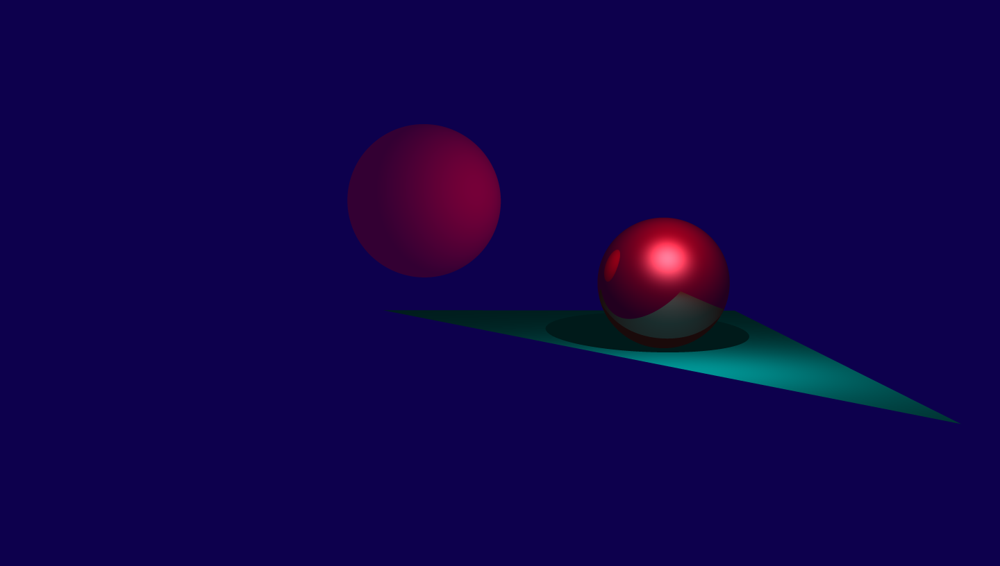

__A simple ray tracer for embeded systems.__ Written in a week as an
introduction to the rust programming language. The ray tracer uses Turner
Whitted's formulation. Surfaces are represented using a modified version of the
phong reflection model. Textures can be embedded or -- as the microcontroller
has limited memory -- procedurally generated on runtime. Remixing of existing
textures is supported through textures modifiers and combiners. Environment
mapping and supersampling is also supported.

[](https://travis-ci.org/Rust-Mikrocontroller-Praktikum-2017/raytracer)


---
<p align=center><strong>Table of Contents</strong></p>

1. [Showcase](#showcase)
2. [Building and Running on your OS](#building-and-running-on-your-os)
3. [Building for the Stm32f7 Microcontroller](#building-for-the-stm32f7-microcontroller)
4. [Executing Unit Tests](#executing-unit-tests)
5. [Benchmarking](#benchmarking)
6. [Converting and Uploading Textures](#converting-and-uploading-textures)

---

### Showcase

Swipe left, right, up or down to rotate the camera around the scene. Use the button
on the backside of the board to cycle through the available scenes.


_Shown above is a specular sphere suspended mid-air in a palace._


_Abstract scene with a red specular sphere, a completely deffuse sphere and a
deffuse triangle._


_Different methods to apply a synthesized tiled 2D texture to an object._

### Building and Running on your OS

Running the commands below, will build and run the ray tracer. The result will
be written to a file called `render.png` in your current working directory.

```
cd desktop && cargo run --release
```

### Building for the Stm32f7 Microcontroller

Run the commands below and [upload the program as described
here](https://github.com/embed-rs/stm32f7-discovery/blob/master/README.md).
Compiling in release mode reduces the time taken for rendering tasks
significantly.

```
cd stm32f7 && xargo build --release
```

### Executing Unit Tests

To execute unit tests run the following commands. Unit test results can also
be viewed on Travis CI by clicking the build badge shown at the beginning of
this document.

```
cd lib && cargo test
```

### Benchmarking

You can benchmark the application using the commands shown below. A simple
scene should take less than 10 milliseconds on a desktop system. Rendering
on the microcontroller should take about 10 seconds.

```
cd lib && cargo test
```

### Converting and Uploading Textures

Move your texture to the `texconv` folder. Run `texconv.html` in your browser.
A file called `texture.rgb` will be downloaded. The file can be included using:

```rs
FileTexture {
    width: 1228, // set correct width here
    height: 613, // set correct height here
    rgbdata: include_bytes!("../../textures/texture.rgb")
},
```

Some browsers like Chrome may require you to invoke the script through a webserver.
You can boot a local http server using `phyton -m SimpleHTTPServer 8080` for python
2 or `python -m http.server 8080` for python 3. Visit `localhost:8080/texconv.html`
to run the script.
